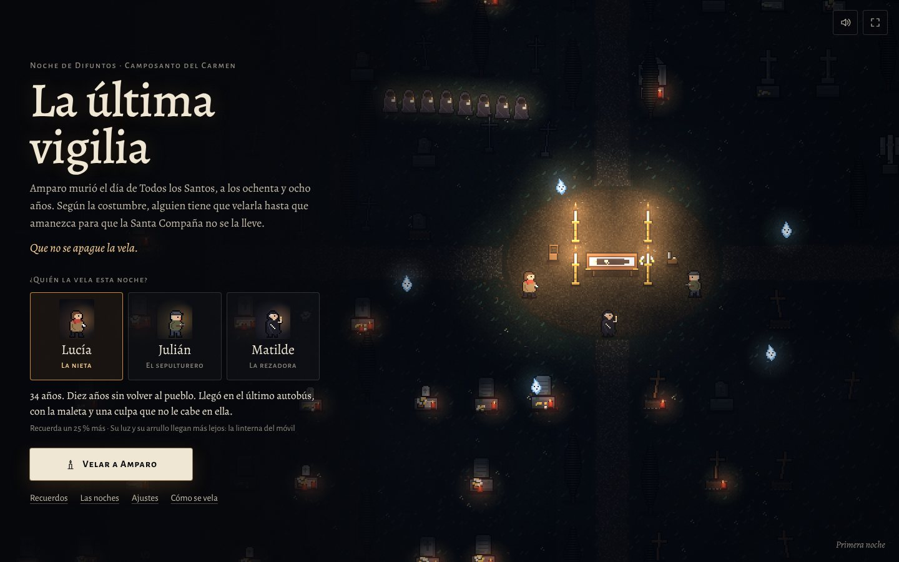

# La última vigilia

[](https://github.com/Big3ppvv/Vigilia/actions/workflows/verify.yml)

Ha muerto Amparo. Según la costumbre, alguien tiene que velarla hasta que amanezca para que la Santa Compaña no se la lleve. Esta noche te toca a ti.

Juego de supervivencia para navegador sobre una Noche de Difuntos, cuatro cirios y lo que se recuerda de quien se va. Diez minutos, de medianoche a las seis. Sin dependencias: el arte, la música y el sonido se generan con código.



## Jugar

Descarga [`la-ultima-vigilia/la-ultima-vigilia.html`](la-ultima-vigilia/la-ultima-vigilia.html) y ábrelo con doble clic en un navegador moderno.

Se mueve con WASD o las flechas, se esquiva con Espacio y se arrulla con E; las armas atacan solas. En el móvil, arrastra el dedo sobre la pantalla. También se puede jugar con mando.

La Compaña viene en procesión a apagar los cirios del velatorio. Para encender uno basta con quedarse a su lado un momento. Si se apagan los cuatro, se llevan a Amparo.

## Una luz distinta para cada persona

| Personaje | Habilidad activa |
|---|---|
| Lucía · la nieta | **Lumbre:** aparta criaturas con fuego y atrae la luz que dejan atrás. |
| Julián · el sepulturero | **Cerco de sal:** deja un círculo que frena y hiere a las criaturas. |
| Matilde · la rezadora | **Responso:** recupera vida, aparta amenazas y retrasa a la Guía cercana. |

Tres faroles opcionales abren otra forma de afrontar la noche. Detente junto a uno durante **3,6 segundos** para encenderlo: recuperas vida y luz para recordar, creas un refugio que frena criaturas y tu habilidad se recarga antes. El minimapa y las flechas te orientan entre el ataúd, los faroles y la Guía.

Las señales de ataque, los reflejos del suelo mojado, las huellas y las luces conservan el dibujo de píxel del camposanto. La mezcla permite ajustar por separado música, ambiente y efectos; la nana responde al peligro y cada habilidad tiene su propio sonido.

El combate acelera el paso: movimiento un 22 % más rápido, ataques un 39 % más frecuentes, esquivas cada 3,2 segundos y hordas más densas. Los disparos, las bajas y las habilidades dejan fogonazos locales, chispas y ondas de luz. Los ajustes de destellos y movimiento reducido permiten atenuarlos.


## Desarrollar

Requiere Node.js 22 o posterior; el servidor de desarrollo usa Python 3. Desde la raíz:

```sh
npm ci
npm run dev
```

Abre <http://localhost:8000>. Después de cambiar los módulos, `npm run build` regenera el HTML que se distribuye. `npm run check` comprueba sintaxis y que ese archivo esté actualizado.

Para ejecutar las pruebas de navegador:

```sh
npx playwright install chromium
npm test
```

La instalación de Playwright solo se usa para verificar el juego. Controles, accesibilidad y pruebas individuales: [guía del juego](la-ultima-vigilia/README.md). Responsabilidades de cada sistema y cómo ampliarlo: [arquitectura](ARCHITECTURE.md).

## Cambiar la historia

Todo el texto (Amparo, quién la vela, sus recuerdos, lo que dice cada uno y los finales) está en [`la-ultima-vigilia/story.js`](la-ultima-vigilia/story.js), y todos los números, en [`la-ultima-vigilia/balance.js`](la-ultima-vigilia/balance.js). Después de editarlos, ejecuta `node build.mjs` dentro de `la-ultima-vigilia/` para regenerar el archivo que se juega.

Controles, lo que pasa cada hora, estructura del código y herramientas de prueba: [`la-ultima-vigilia/README.md`](la-ultima-vigilia/README.md).


